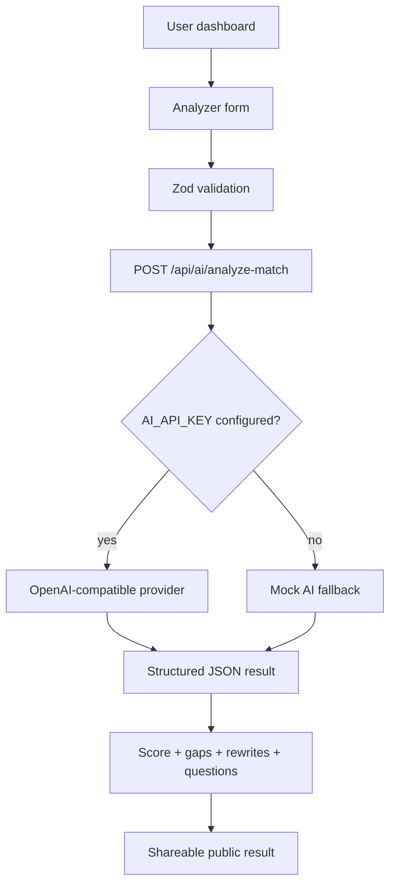

# JobFit AI · 职配智选

AI-powered resume matching, skill gap analysis, and bilingual career improvement assistant.

JobFit AI helps job seekers compare a resume against a job description, get a transparent application readiness score, identify missing skills and keywords, rewrite resume bullets safely, and prepare for interviews in English or Chinese.

## Why I Built This

I built this as a portfolio-grade AI SaaS demo for early-career developers and internship applicants. The goal is not to predict hiring outcomes, but to help applicants improve their materials honestly before applying.

## Target Users

- Computer Science students applying for internships
- Junior developers tailoring resumes for React, Next.js, and AI product roles
- Bilingual English/Chinese applicants targeting international or Chinese tech teams
- Recruiters reviewing how I think about AI, privacy, fairness, and product UX

## Key Features

- Resume vs job description application readiness score
- Weighted scoring explanation
- Skill gap and keyword analysis
- Safe AI resume rewrite suggestions
- Interview question generation
- English, Chinese, and bilingual output modes
- Demo mode that works without Supabase or AI keys
- Public shared result page
- Dashboard charts and mock analysis history

## Tech Stack

| Technology | Purpose | Why chosen |
|---|---|---|
| Next.js App Router | Web app and API routes | Production-ready React framework |
| TypeScript | Type safety | Safer refactoring and clearer contracts |
| Tailwind CSS | Styling | Fast, consistent SaaS UI |
| shadcn-style components | UI primitives | Clean components without heavy design lock-in |
| TanStack Query | API state | Reliable client/server state handling |
| React Hook Form + Zod | Forms and validation | Validates inputs before AI calls |
| Recharts | Dashboard charts | Simple data visualization |
| OpenAI SDK | AI provider call | Server-side OpenAI-compatible integration |
| Prisma schema | Database plan | Defines Phase 3 Supabase/PostgreSQL model |
| Supabase | Auth/database plan | Production-ready upgrade path |
| Vercel | Deployment | Fast Next.js hosting |

## Architecture



## Demo Account

- Email: `demo@jobfit.ai`
- Password: `demo123456`

Phase 1 demo login is mock-based and works without Supabase.

## Local Setup

```bash
npm install
cp .env.example .env.local
npm run dev
```

Open `http://localhost:3000`.

## Environment Variables

See `.env.example`.

For OpenAI:

```env
AI_PROVIDER=openai
AI_API_KEY=your_openai_api_key
AI_MODEL=gpt-4o-mini
```

If `AI_API_KEY` is missing, the app returns a realistic mock analysis and never crashes.

## Database Setup

The Prisma schema is in `prisma/schema.prisma`. Phase 1 does not require a database. Phase 3 can connect this schema to Supabase PostgreSQL with `DATABASE_URL`.

## Privacy and Security

- AI keys are never exposed to client components.
- AI calls go through server routes only.
- Resume text is treated as sensitive.
- Demo mode does not store user input.
- AI suggestions are for career guidance only.

## Bias and Fairness

The AI evaluates only job-relevant skills, experience, keywords, projects, education relevance, and resume clarity. It must not infer or score age, gender, race, nationality, religion, health, family status, political views, or other protected attributes.

The score represents **application readiness**, not hiring probability.

## AI-Assisted Development

This project was built using an AI-assisted workflow. I used Claude, Codex, and Cursor-style workflows to help plan the architecture, generate initial component structures, debug TypeScript issues, and improve bilingual documentation.

All generated code was reviewed, adjusted, and tested manually. AI tools were used as a development accelerator. The product direction, privacy rules, fairness decisions, technical architecture, and final implementation choices were made by me.

This workflow reflects how modern junior developers actually work, and I consider it an honest and valuable professional skill to document.

## Future Improvements

- Supabase Auth and database persistence
- Real saved resume/job libraries
- PDF/DOCX extraction
- Export result as PDF
- Upstash Redis rate limiting
- Full analysis sharing with generated tokens
- More bilingual resume writing styles

## 中文简介

JobFit AI（职配智选）是一个 AI 简历匹配与求职优化平台，帮助求职者对比简历和岗位描述，生成申请准备度评分、技能差距、关键词建议、简历优化建议和面试问题。该项目强调隐私、安全、公平和可解释评分，适合作为面向招聘方的 AI SaaS 作品集项目。
